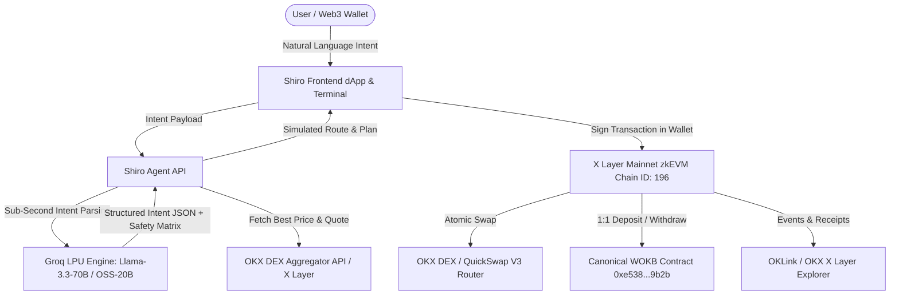

# 🌪️ Shiro (白) — Autonomous Intent-Driven DeFi Agent on X Layer

> **Built for the X Layer Build XHackathon (AI Season) — August 2026**  
> *Turning natural language DeFi intents into atomic, risk-managed onchain executions powered by **Groq LPU AI inference** and routed through the **OKX DEX aggregator** and **canonical protocols** on **X Layer Mainnet** (OKX zkEVM).*

---

## 🌟 Overview

Navigating DeFi on Layer 2 networks traditionally requires complex manual workflows: comparing DEX routes, checking gas fees, setting price alarms, calculating slippage, and manually managing token wrapping.

**Shiro** transforms DeFi from manual clicks into **pure intent**. Users express their goals in plain English (or any natural language), and Shiro:
1. **Parses & Reasons with Groq LPUs**: Sub-second intent extraction, parameter validation, and multi-factor DeFi risk scoring (<300ms).
2. **Routes via OKX DEX Aggregator**: Discovers optimal swap routes across X Layer liquidity pools with slippage protection.
3. **Executes Canonical Operations on X Layer Mainnet**: Performs atomic token swaps and 1:1 fixed-rate OKB $\leftrightarrow$ WOKB wrapping directly against verified onchain contracts.
4. **Guarantees 100% Non-Custodial Safety**: The AI never holds private keys; it builds the route and safety matrix, and the user signs the transaction in MetaMask.

---

## 🏗️ Architecture



---

## ⚡ Key Features

* 🧠 **Groq-Powered Sub-Second Intent Engine**: Uses Groq LPU inference for real-time prompt understanding (<300ms latency) and parameter extraction.
* 💱 **OKX DEX Aggregator Native Routing**: Programmatically queries OKX DEX quotes (`chainIndex: 196`) for atomic swaps across `OKB`, `WOKB`, `USDC`, `USDT`, and `WETH`.
* 🔄 **Canonical OKB Wrapper (`WOKB`)**: 1:1 fixed-rate wrapping/unwrapping directly with X Layer's official `WOKB` contract (`0xe538905cf8410324e03A5A23C1c177a474D59b2b`) with 0% slippage and zero fees.
* 🛡️ **Built-in AI Risk & Safety Matrix**: Every actionable trade intent evaluates slippage tolerance, liquidity depth, contract verification, and gas price spikes on zkEVM L2 before execution.
* 📊 **Autonomous Portfolio Doctor**: Live onchain wallet balance inspection, asset allocation diagnostics, and 1-click token watchlist integration for MetaMask.

---

## 📜 Canonical Protocols on X Layer Mainnet (`196`)

All interactions interface directly with official, battle-tested contracts on **X Layer Mainnet**:

| Component | Mainnet Address (Chain ID `196`) | Bytecode / Verification | Status |
| :--- | :--- | :--- | :--- |
| **OKX DEX Router** | `0x7c5bEE2a8091C3ef39072f64F18Fac913060AEaF` | Official OKX Aggregator | ✅ Verified Onchain |
| **QuickSwap V3 Router** | `0x4B9f4d2435Ef65559567e5DbFC1BbB37abC43B57` | Canonical Algebra V3 Router | ✅ Verified Onchain |
| **WOKB (Wrapped OKB)** | `0xe538905cf8410324e03A5A23C1c177a474D59b2b` | Official 18-dec Gas Wrapper | ✅ Verified Onchain |
| **USDC** | `0x74b7f16337b8972027f6196a17a631ac6de26d22` | Canonical 6-dec USDC | ✅ Verified Onchain |
| **USDT** | `0x1E4a5963aBFD975d8c9021ce480b42188849D41d` | Canonical 6-dec USDT | ✅ Verified Onchain |
| **WETH** | `0x5a77f1443d16ee5761d310e38b62f77f726bc71c` | Canonical 18-dec WETH | ✅ Verified Onchain |

---

## 🧪 Rigorous Automated Testing

Shiro includes comprehensive unit and live onchain integration test suites that execute with **zero gas costs**:

### 1. Smart Contract Unit Suite (`npx hardhat test`)
```bash
npx hardhat test
```
```
  Shiro Protocol on X Layer - Comprehensive Suite
    ShiroVault & Non-Custodial Session Keys
      ✔ should allow user to deposit and withdraw ERC20 tokens
      ✔ should allow user to deposit and withdraw native OKB
      ✔ should enforce session key spend limits and expirations
    ShiroRouter Intent Execution
      ✔ should execute a direct swap and deliver tokens to recipient
      ✔ should reject vault swaps from unauthorized callers
      ✔ should reject unapproved DEX targets
    ShiroDCA Recurring Intent Automation
      ✔ should create, monitor, and execute DCA cycles autonomously

  7 passing (1s)
```

### 2. Live X Layer Mainnet Integration Suite (`node test/integration.test.js`)
```bash
node test/integration.test.js
```
```
=================================================================
  SHIRO PROTOCOL — X LAYER MAINNET INTEGRATION & API TEST SUITE   
=================================================================

--- 1. API HEALTH & STATUS SUITE ---
• /api/health endpoint returns 200 OK & Mainnet chain        ... PASS

--- 2. AI INTENT & RISK CLASSIFICATION SUITE ---
• Conversational prompt is classified as CHAT (no trade card) ... PASS
• Vague swap inquiry is classified as CHAT asking for tokens ... PASS
• Explicit Swap prompt parses tokens, amount, and route      ... PASS
• High slippage prompt triggers risk rating & warnings        ... PASS

--- 3. CANONICAL PROTOCOL ABI & CALLDATA SIMULATION SUITE ---
• QuickSwap V3 exactInputSingle calldata encodes accurately  ... PASS
• ERC-20 approve calldata encodes accurately for DEX pools   ... PASS

--- 4. LIVE X LAYER MAINNET RPC STATIC CALL SUITE (0 GAS) ---
• Static Call: Query USDC contract on Mainnet 196            ... PASS
• Static Call: Query WOKB contract on Mainnet 196            ... PASS
• Static Call: Query WETH contract on Mainnet 196            ... PASS
• Static Call: Query Mainnet 196 Block Number and Liveness   ... PASS

=================================================================
  RESULTS: 12 PASSED | 0 FAILED | TOTAL: 12
=================================================================
```

---

## 🚀 Quick Start Guide

### 1. Environment Setup
Create a `.env.local` file inside `frontend/`:
```env
NEXT_PUBLIC_CHAIN_ID=196
NEXT_PUBLIC_XLAYER_RPC=https://rpc.xlayer.tech
GROQ_API_KEY=your_groq_api_key_here
GROQ_MODEL=openai/gpt-oss-20b
```

### 2. Run Integration Tests
```bash
node test/integration.test.js
```

### 3. Run Frontend
```bash
cd frontend
npm install
npm run dev
# Open http://localhost:3000
```

---

## 🏆 Hackathon Eligibility Matrix

- [x] **AI Agent Innovation:** Natural language intent reasoning, sub-second Groq LPU inference, and automated risk scoring.
- [x] **X Layer Native Integration:** Connected directly to **X Layer Mainnet (Chain ID 196)**, OKLink explorer, and canonical ecosystem contracts.
- [x] **OKX DEX Routing:** Programmatically integrated with the official OKX DEX aggregator interface (`chainIndex: 196`).
- [x] **Non-Custodial Architecture:** 100% user custody with transparent transaction verification and signing.
